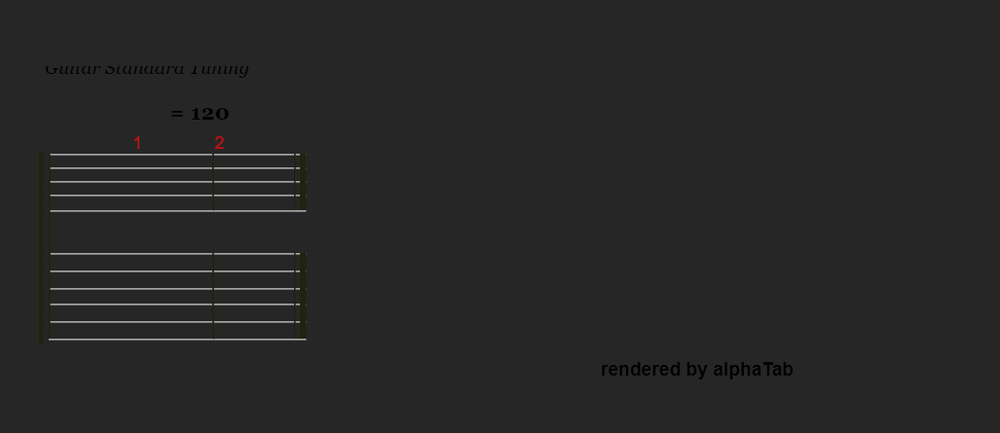

render.md

这个分支是为了以更简单的方法解决渲染问题，然后快速进入 worker.mjs 和 audiocontent 这两个大难题。

同时记录一下奇怪的问题：

热重载后手动关闭开启，第一次渲染没有问题

 （这里只是缺失了一些字体加载而已）

但是有些时候不稳定地会出现渲染失败无法获取资产的问题，

---

好的，我们来整理一下目前的工作和进展。

**总结概览**

**Context:**

1.  **Previous Conversation:**
    你正在开发一个 Obsidian 插件，目标是使用 `alphatab.js` 来显示和播放吉他谱文件（如 GPX, GP5 等）。核心挑战在于 Obsidian (基于 Electron) 的特殊环境下，如何正确实例化 `AlphaTabApi` 并确保所有依赖资源（尤其是音乐符号字体 Bravura）被正确加载和渲染。你已经进行了多次尝试，包括修改 `alphatab.js` 的设置、处理 Node.js 环境与浏览器环境的差异，以及深入研究字体加载机制。

2.  **Current Work:**
    当前的工作重心是解决 Bravura 音乐符号字体无法正确显示的问题。尽管你已经成功地通过 `smuflFontSources` 设置，使用 Base64 编码的 Data URLs 将其他字体文件（WOFF, WOFF2, OTF, EOT, SVG）和 `bravura_metadata.json` 注入到 `alphatab.js` 的设置中，并且这些字体似乎也得到了初步加载的确认（如控制台输出所示），但乐谱渲染时音乐符号仍然缺失。
    最新的控制台错误信息 `[AlphaTab][AlphaTab] Font directory could not be detected, cannot create style element` 表明，即使 `smuflFontSources` 提供了字体数据，`alphatab.js` 内部的 `createStyleElement` 方法在尝试为 Bravura 字体生成 `@font-face` CSS 规则时，因 `fontDirectory` 被设为 `null` (或一个无效的虚拟路径如 `'fonts/'`) 而失败。这导致了 Bravura 字体无法通过 CSS 应用到渲染出的 SVG 元素上。
    你提供了相关的 GitHub discussion，`alphatab.js`源码片段，以及一些示例代码，希望从中找到解决此问题的突破口。

3.  **Key Technical Concepts:**

    -   **`alphatab.js`**: 核心的吉他谱渲染库。
    -   **`AlphaTabApi`**: 在类浏览器环境中与 `alphatab.js` 交互的主要接口。
    -   **Obsidian Plugin Development**: 为 Obsidian.md (Electron 应用) 开发插件。
    -   **Electron/Node.js Environment**: 需要处理其与标准浏览器环境的差异，特别是 `window`, `document`, `process`, `module` 等全局对象的存在和行为。
    -   **Font Loading**:
        -   **Bravura Font**: SMuFL 标准的音乐符号字体，是正确渲染乐谱的关键。
        -   **`settings.core.fontDirectory`**: `alphatab.js` 用于查找字体文件的目录路径。在你的尝试中，曾设为 `null` 或虚拟路径。
        -   **`settings.core.smuflFontSources`**: 一个允许直接提供字体数据 (如 Data URLs) 的配置项，你主要依赖此项加载字体。
        -   **`Environment.createStyleElement`**: `alphatab.js` 内部用于动态创建 `<style>` 标签并注入 `@font-face` 规则的方法。
        -   **Data URLs**: 将文件内容（如字体）编码为 Base64 字符串嵌入到 URL 中，以避免网络请求或文件系统路径依赖。
    -   **File System (`fs`, `path`)**: Node.js 模块，用于在插件加载时读取本地字体文件并转换为 Data URLs。
    -   **`alphaTab.Environment.webPlatform = WebPlatform.Browser`**: 强制 `alphatab.js` 以浏览器模式运行。
    -   **Environment Hacking**: 通过临时移除 `globalThis.process` 和 `globalThis.module` 来模拟纯浏览器环境，以便 `AlphaTabApi` 能够实例化。
    -   **Content Security Policy (CSP)**: 在 Electron 环境中需要注意，可能会影响动态加载脚本或样式。你的插件通过内联注入 `styles.css` 来规避部分问题。

4.  **Relevant Files and Code:**

    -   **`./src/ITabManager.ts`**:

        -   **重要性**: 管理 `AlphaTabApi` 实例、核心设置（尤其是字体设置）、乐谱加载和事件绑定。这是解决字体问题的核心文件。
        -   **关键代码段 (基于你的最新版本)**:

            ```typescript
            // ITabManager.ts - initializeAndLoadScore method

            // 强制禁用任何网络资源加载 - 非常重要的字体设置
            this.settings.core.fontDirectory = null; // 或者尝试过 'fonts/'
            this.settings.core.scriptFile = null;

            // ...
            // --- 字体加载：完全基于 data:URL，禁用所有 HTTP 方式 ---
            const pluginRootPath = this.pluginInstance.actualPluginDir;
            // ...
            const fontAssetsPath = path.join(
            	pluginRootPath,
            	"assets",
            	"alphatab",
            	"font"
            );
            const fontDataUrls: Record<string, string> = {};
            // ... (循环读取 Bravura.woff/woff2/otf/eot/svg 和 bravura_metadata.json 并转为 data URL)

            if (fontLoaded) {
            	this.settings.core.smuflFontSources = fontDataUrls;
            	// ...
            }

            // 环境 hack
            // @ts-ignore
            if (alphaTab.Environment && typeof WebPlatform !== "undefined") {
            	// @ts-ignore
            	alphaTab.Environment.webPlatform = WebPlatform.Browser;
            }
            this.api = new alphaTab.AlphaTabApi(
            	this.mainElement,
            	this.settings
            );

            // ... 尝试在 API 初始化后再次确认和修正字体设置
            if (this.api) {
            	// @ts-ignore
            	if (this.api.settings && this.api.settings.core) {
            		// @ts-ignore
            		this.api.settings.core.fontDirectory = null;
            		// @ts-ignore
            		if (
            			!this.api.settings.core.smuflFontSources ||
            			typeof this.api.settings.core.smuflFontSources !==
            				"object"
            		) {
            			// @ts-ignore
            			this.api.settings.core.smuflFontSources = fontDataUrls;
            		}
            	}
            }
            ```

    -   **`./src/main.ts`**:

        -   **重要性**: 插件入口，负责获取插件的实际磁盘路径 `actualPluginDir`，并将其传递给 `TabView` 和 `ITabManager`，这对于 `fs` 读取本地字体至关重要。
        -   **关键代码段**:
            ```typescript
            // main.ts - onload method
            const vaultRoot = (this.app.vault.adapter as any)
            	.basePath as string;
            const pluginDir = path.join(vaultRoot, this.manifest.dir);
            // ... (逻辑来确认 actualPluginDir)
            this.actualPluginDir = actualPluginDir;
            // ...
            this.registerView(VIEW_TYPE_TAB, (leaf) => {
            	const view = new TabView(leaf, this); // 'this' (plugin instance) is passed
            	return view;
            });
            ```

    -   **`./src/TabView.ts`**:

        -   **重要性**: Obsidian 的视图，承载 `ITabManager` 和 `ITabUIManager`，并将插件实例 (`pluginInstance`) 传递给 `ITabManager`。
        -   **关键代码段**:

            ```typescript
            // TabView.ts - constructor and onLoadFile
            constructor(leaf: WorkspaceLeaf, plugin: any) { // plugin instance received
                super(leaf);
                this.pluginInstance = plugin;
            }

            override async onLoadFile(file: TFile): Promise<void> {
                // ...
                const managerOptions: ITabManagerOptions = {
                    pluginInstance: this.pluginInstance, // passed to manager
                    // ...
                };
                this.atManager = new ITabManager(managerOptions);
                // ...
                await this.atManager.initializeAndLoadScore(file);
            }
            ```

    -   **Console Output Logs**:

        -   **重要性**: 提供了关键的错误信息和程序执行流程。
        -   **关键错误 (当 `fontDirectory` 为 `null`)**:
            `[AlphaTab][AlphaTab] Font directory could not be detected, cannot create style element`
        -   **关键错误 (当 `fontDirectory` 为 `'fonts/'`)**:
            `[AlphaTab][Font] [alphaTab] Loading Failed, rendering cannot start NetworkError: A network error occurred.` (因为尝试从相对路径 `fonts/` 加载)
            `[AlphaTab][Font] [alphaTab] Loading Failed, rendering cannot start Font not available`

    -   **GitHub Discussions & `alphatab.js` Source/Examples**:
        -   **重要性**: 提供了 `alphatab.js` 开发者和其他用户在类似环境 (Electron, Node.js, TiddlyWiki) 中处理字体和 API 使用的经验和解决方案。
        -   **特别相关的讨论**:
            -   TiddlyWiki5 集成: 提到了覆盖 `Environment.createStyleElement` 并自行管理 CSS `@font-face` 规则的成功经验。
            -   Electron/Node.js 使用 `AlphaTabApi`: 强调了 `AlphaTabApi` 主要用于浏览器前端，Node.js 后端应使用 Low Level APIs。Obsidian 插件环境更接近于 Electron 的渲染进程（前端）。
            -   `fontDirectory` 的作用: 在浏览器示例中通常指向一个有效的 Web 路径。

5.  **Problem Solving:**

    -   **已解决**:
        -   成功在 Obsidian 插件中实例化了 `AlphaTabApi`，通过环境 hack（临时移除 `process` 和 `module` 全局变量）和设置 `WebPlatform.Browser`。
        -   通过 `settings.core.smuflFontSources` 和 Data URLs 成功将 Bravura 字体的 WOFF, WOFF2, OTF, EOT, SVG 格式以及 `bravura_metadata.json` 的数据提供给 `alphatab.js`。控制台日志显示这些数据被编码和设置到 `settings` 对象中。
        -   能够加载并解析吉他谱文件。
    -   **当前难题**:
        -   **Bravura 音乐符号不显示**: 尽管字体数据已通过 `smuflFontSources` 提供，`alphatab.js` 在创建其内部样式（`<style>`标签注入`@font-face`）时遇到问题。
        -   当 `settings.core.fontDirectory` 为 `null` 时，`alphatab.js` 抛出错误 `Font directory could not be detected, cannot create style element`。这表明即使有 `smuflFontSources`，`createStyleElement` 逻辑可能仍然依赖 `fontDirectory`，或者在 `fontDirectory` 为 `null` 时无法正确生成指向 Data URL 的 `@font-face` 规则。
        -   当 `settings.core.fontDirectory` 设置为一个虚拟的相对路径 (如 `'fonts/'`) 时，`alphatab.js` 尝试从该路径进行网络请求加载字体，导致失败，因为该路径在 Obsidian 插件环境中不是一个有效的 HTTP 服务端点。

6.  **Pending Tasks and Next Steps:**

    1.  **总结当前工作和理解 (即本文档)**：你已经要求我对你目前的工作进行总结和理解。
    2.  **分析社区讨论和源码以寻求解决方案**：

        -   你的要求：“我们整理一下社区的问题，看一下开发者和包作者的想法。”
        -   目标：深入理解 GitHub discussions (特别是 TiddlyWiki5 的解决方案) 和你提供的 `alphatab.js` 源码片段 (`Environment.ts`, `CoreSettings.ts`, `BrowserUiFacade.ts`) 以及各种浏览器环境的示例。
        -   关注点：
            -   `Environment.createStyleElement` 的确切行为，以及它如何与 `settings.core.fontDirectory` 和 `settings.core.smuflFontSources` 交互。
            -   当 `fontDirectory` 为 `null` 时，`createStyleElement` 为何失败，以及它是否能够/应该回退到使用 `smuflFontSources` 中的 Data URLs 来构建 `@font-face` 规则。
            -   评估 TiddlyWiki5 社区用户提出的覆盖 `Environment.createStyleElement` 方法（使其返回 `false` 或一个空元素）并由插件自身通过 `styles.css` 或动态创建的 `<style>` 标签来定义所有必要的 `@font-face` 规则（使用已有的 Data URLs）的可行性。

    3.  **解决 Bravura 字体渲染问题**：

        -   你的要求：“我想要解决这样一个问题：之前所有的字体文件都被有效加载而且显示了，唯独音乐符号字体 Bravura 是个特例，它会尝试创建 `<style>` 标签注入 `@font-face`，而这个在目前的代码中没有起作用，导致完整曲谱的渲染只差这一步”。
        -   **初步行动计划** (基于现有信息和社区讨论的启示):

            -   **方案 A: 尝试阻止 alphaTab 自动创建样式，并手动管理**

                1.  在 `ITabManager.ts` 中，在实例化 `AlphaTabApi` _之前_，尝试覆盖 `alphaTab.Environment.createStyleElement`。

                    ```typescript
                    // Potentially in ITabManager before new AlphaTabApi()
                    const originalCreateStyleElement =
                    	alphaTab.Environment.createStyleElement;
                    alphaTab.Environment.createStyleElement = (
                    	uniqueFontHash: string,
                    	cssContent: string,
                    	targetDocument?: Document
                    ): HTMLStyleElement | null => {
                    	console.debug(
                    		"[ITabManager] Custom createStyleElement called. Preventing default style creation."
                    	);
                    	// Option 1: Return null or an empty, non-functional element
                    	// return null;

                    	// Option 2 (if you want to log but still prevent):
                    	// console.debug('[ITabManager] CSS content alphaTab tried to inject:', cssContent);
                    	// return null; // Or an empty style element that won't affect anything.

                    	// Or, if you want to try to use the provided cssContent but ensure it's correctly handled by Obsidian:
                    	// This is more complex due to potential CSP and timing issues.
                    	// For now, let's try preventing it.
                    	return null; // Simplest way to test prevention
                    };
                    ```

                2.  在你的插件的 `styles.css` (或其他方式注入的 CSS) 中，手动添加 `@font-face` 规则，使用你已经生成的 Bravura 字体的 Data URLs。你需要确保字体族名称与 `alphatab.js` 期望的名称（通常是 'alphaTab' 或 'BravuraSymbolAlphaTab'，需要确认）匹配。
                    ```css
                    /* Example for styles.css - replace with actual data URLs and correct family name */
                    @font-face {
                    	font-family: "alphaTab"; /* Or whatever alphaTab expects for SMuFL */
                    	src: url("YOUR_BRAVURA_WOFF2_DATA_URL") format("woff2"),
                    		url("YOUR_BRAVURA_WOFF_DATA_URL") format("woff");
                    	font-weight: normal;
                    	font-style: normal;
                    }
                    ```
                    你需要在 `ITabManager` 中获取这些 Data URLs，或者以某种方式使它们在 CSS 中可用。由于 CSS 文件是静态的，直接将动态生成的 Data URLs 放入 `styles.css` 不太现实，除非在构建时处理。更可行的是在插件加载时动态创建并注入一个包含这些 `@font-face` 规则的 `<style>` 标签到 `document.head`。

            -   **方案 B: 深入研究 `fontDirectory` 和 `smuflFontSources` 的协同工作**
                如果方案 A 过于复杂或有副作用，继续研究是否可以通过特定组合的 `fontDirectory` (例如一个无害的、已知的、空的占位符路径，或者确认 `null` 应该是正确的) 和 `smuflFontSources` 来让 `alphatab.js` 正确地自行处理基于 Data URL 的 `@font-face` 注入，而不会引发错误或尝试进行无效的网络请求。这可能需要更仔细地分析 `alphatab.js` 内部的 `BrowserUiFacade.createStyleElements` 和 `FontLoadingChecker.checkForFontAvailability`（如果你使用了调试补丁）。

    我的理解是，你已经非常接近成功了，主要障碍在于 `alphatab.js` 内部处理 SMuFL 字体（Bravura）的 `@font-face` 注入逻辑与 Obsidian 插件环境以及你采用的 Data URL 策略之间的兼容性。社区的讨论，特别是关于 TiddlyWiki 的解决方案，为你提供了一个非常有价值的思路。
