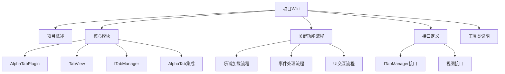

# Interactive Tabs 插件文档结构



## 1. 项目概述
- 插件功能简介
- 技术架构图
- 环境要求

## 2. 核心模块

### 2.1 AlphaTabPlugin

#### 类职责
Obsidian插件主入口，负责：
- 插件生命周期管理(onload/onunload)
- 视图注册和管理
- 设置加载和保存

#### 主要方法
```typescript
class AlphaTabPlugin extends Plugin {
  async onload(): Promise<void> {
    // 初始化逻辑
    this.registerView(VIEW_TYPE_TAB, (leaf) => new TabView(leaf, this));
  }
  
  loadSettings(): Promise<void> {
    // 加载配置
  }
}
```

#### 使用示例
```typescript
const plugin = new AlphaTabPlugin(app, manifest);
await plugin.loadSettings();
```

#### 相关依赖
- Obsidian Plugin API
- TabView组件

### 2.2 TabView

#### 类职责
文件视图实现，负责：
- 乐谱文件渲染展示
- 用户交互处理
- AlphaTab实例管理

#### 主要方法
```typescript
class TabView extends FileView {
  async onLoadFile(file: TFile): Promise<void> {
    // 加载乐谱文件
  }

  onChangeTracks(selectedTracks: Track[]): void {
    // 轨道选择处理
  }
}
```

#### 关键生命周期
1. `onLoadFile`: 文件加载时初始化AlphaTab
2. `onResize`: 处理视图尺寸变化
3. `onUnloadFile`: 清理资源

#### 使用示例
```typescript
const view = new TabView(leaf, plugin);
await view.onLoadFile(file);
```

#### 相关依赖
- Obsidian FileView
- ITabManager
- AlphaTab API

### 2.3 ITabManager

#### 类职责
核心乐谱管理控制器，负责：
- 播放/暂停/停止控制
- 播放状态管理
- AlphaTab API桥接
- 字体预加载优化

#### 主要方法
```typescript
class ITabManager {
  playPause(): void {
    // 播放/暂停切换
  }

  setDarkMode(isDark: boolean): void {
    // 主题切换
  }

  triggerFontPreload(fontFamilies: string[]): void {
    // 字体预加载
  }
}
```

#### 关键功能
1. 播放状态同步
2. 轨道切换处理
3. 性能优化(字体预加载)

#### 使用示例
```typescript
const manager = new ITabManager(options);
manager.playPause();
manager.setDarkMode(true);
```

#### 相关依赖
- AlphaTab API
- TabView组件
- 事件处理系统

### 2.4 AlphaTab集成

#### 核心组件
1. AlphaTabEventBinder: 事件桥接器
2. initializeAndLoadScore: 初始化加载器

#### 事件绑定系统
```typescript
class AlphaTabEventBinder {
  static bind(api: any, eventHandlers: ITabManagerOptions) {
    // 绑定AlphaTab事件到ITabManager
  }
}
```

#### 初始化流程
1. 创建AlphaTab API实例
2. 配置渲染选项
3. 加载字体资源
4. 绑定事件处理器

#### 特殊处理
- 字体预加载优化
- 暗黑模式适配
- 性能调优配置

#### 使用示例
```typescript
AlphaTabEventBinder.bind(api, {
  onScoreLoaded: (score) => {
    // 乐谱加载完成处理
  }
});
```

#### 相关依赖
- AlphaTab核心库
- 字体资源文件
- 事件管理系统

## 3. 关键功能流程

### 3.1 乐谱加载流程
1. 文件选择
2. AlphaTab初始化
3. 轨道加载
4. 渲染处理

### 3.2 事件处理流程
- 乐谱加载事件
- 播放状态事件
- 错误处理

## 4. 接口定义

### 4.1 ITabManager接口
```typescript
interface ITabManager {
  playPause(): void;
  setDarkMode(isDark: boolean): void;
  // ...
}
```

### 4.2 视图接口
- 文件视图契约
- 交互协议

## 5. 工具类说明
- 事件处理器
- 类型定义
- 工具函数
