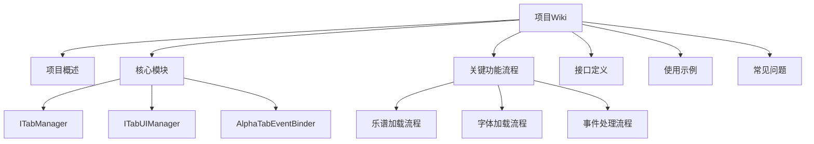

# Interactive Tabs 插件文档



## 1. 核心模块

### 1.1 ITabManager

#### 类职责
核心乐谱管理控制器，负责：
- AlphaTab API实例管理
- 播放控制(播放/暂停/停止)
- 主题切换(暗黑/亮色模式)
- 字体预加载和注入
- 资源路径管理

#### 主要方法

```typescript
class ITabManager {
  /**
   * 切换暗黑/亮色模式
   * @param isDark - 是否启用暗黑模式
   */
  setDarkMode(isDark: boolean): void;

  /**
   * 播放/暂停切换
   * @throws 当播放器禁用时显示通知
   */
  playPause(): void;

  /**
   * 停止播放
   */
  stop(): void;

  /**
   * 触发字体预加载
   * @param fontFamilies - 需要预加载的字体列表
   */
  triggerFontPreload(fontFamilies: string[]): void;

  /**
   * 加载并初始化乐谱
   * @param file - Obsidian文件对象
   * @returns Promise<void>
   */
  initializeAndLoadScore(file: TFile): Promise<void>;
  
  // 其他方法...
}
```

#### 使用示例
```typescript
const manager = new ITabManager(options);
await manager.initializeAndLoadScore(file);
manager.setDarkMode(true);
manager.playPause();
```

### 1.2 ITabUIManager

#### 组件结构
- 主内容区域(AlphaTab渲染容器)
- 控制栏(播放/暂停/停止按钮)
- 加载状态遮罩层
- 错误显示组件
- 轨道选择侧边栏

#### 交互逻辑
1. 文件加载时显示加载状态
2. 乐谱渲染完成后更新UI
3. 播放状态变化时更新控制栏
4. 错误发生时显示错误信息

### 1.3 AlphaTabEventBinder

#### 事件绑定机制
支持绑定以下AlphaTab事件：
- `error`: 错误处理
- `renderStarted`: 渲染开始
- `renderFinished`: 渲染完成  
- `scoreLoaded`: 乐谱加载完成
- `playerStateChanged`: 播放状态变化
- `fontLoaded`: 字体加载完成
- `soundFontLoaded`: 音色库加载完成

#### 绑定示例
```typescript
AlphaTabEventBinder.bind(api, {
  onScoreLoaded: (score) => {
    console.log("乐谱加载完成:", score.title);
  },
  onError: (error) => {
    console.error("AlphaTab错误:", error.message);
  }
});
```

## 2. 关键功能流程

### 2.1 乐谱加载流程
1. 检查容器尺寸有效性
2. 清理现有AlphaTab实例
3. 初始化AlphaTab设置：
   - 设置Worker脚本路径
   - 配置音色库路径
   - 加载字体资源
4. 应用环境hack处理
5. 创建AlphaTabApi实例
6. 绑定事件处理器
7. 读取并加载乐谱文件

### 2.2 字体加载流程
1. 检查字体文件是否存在
2. 将字体编码为Data URL
3. 注入@font-face样式
4. 配置AlphaTab使用内联字体

### 2.3 事件处理流程
1. AlphaTab触发原生事件
2. 通过AlphaTabEventBinder转发
3. ITabManager处理核心逻辑
4. ITabUIManager更新UI状态

## 3. 使用示例

### 3.1 基本用法
```typescript
// 创建TabView实例
const view = new TabView(leaf, plugin);

// 加载乐谱文件
await view.onLoadFile(file);

// 切换暗黑模式
view.atManager.setDarkMode(true);
```

### 3.2 配置示例
```typescript
const managerOptions = {
  pluginInstance: plugin,
  app: app,
  mainElement: containerEl,
  onScoreLoaded: (score) => {
    console.log("乐谱加载完成:", score.title);
  },
  onError: (error) => {
    console.error("发生错误:", error.message);
  }
};
```

## 4. 常见问题

### 4.1 尺寸问题处理
- 确保容器元素有有效尺寸
- 添加最小宽高样式保护：
  ```css
  .at-main-content {
    min-width: 300px;
    min-height: 150px;
  }
  ```

### 4.2 资源路径配置
- 所有资源路径相对于插件目录
- 字体文件必须放在`assets/alphatab/font/`目录
- 音色库必须放在`assets/alphatab/soundfont/`目录

### 4.3 暗黑模式适配
```typescript
// 检测当前主题
const isDark = document.body.classList.contains("theme-dark");
manager.setDarkMode(isDark);

// 监听主题变化
app.workspace.on("css-change", () => {
  manager.setDarkMode(!manager.getDarkMode());
});